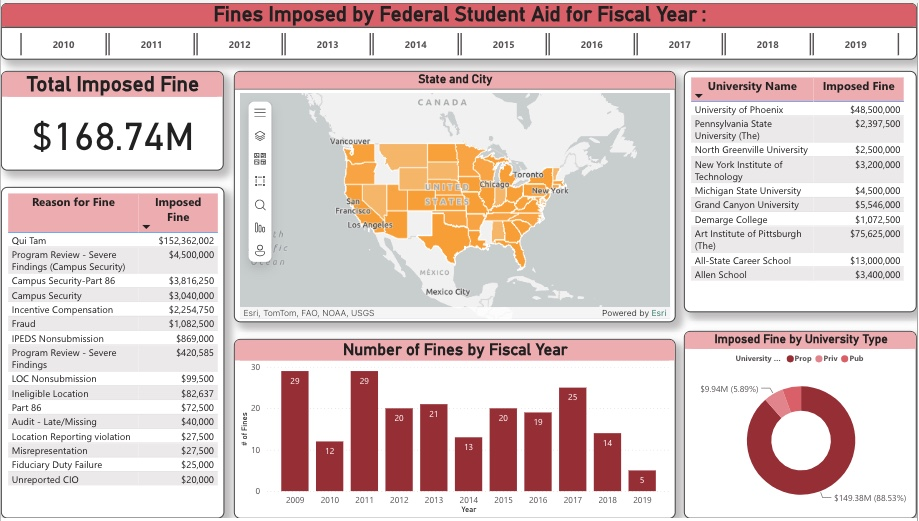
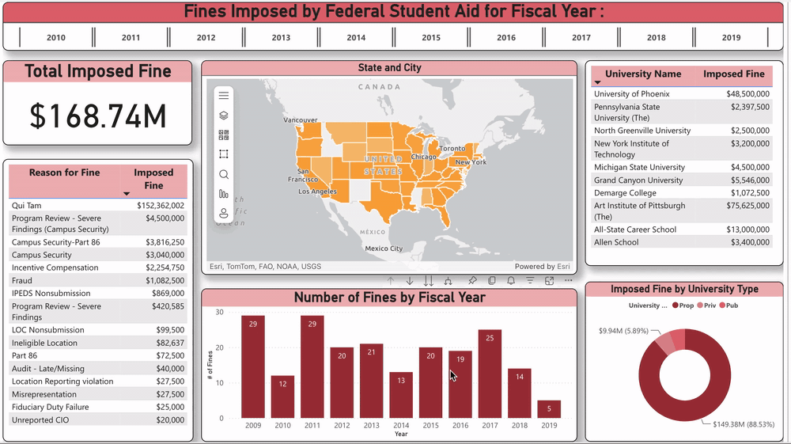
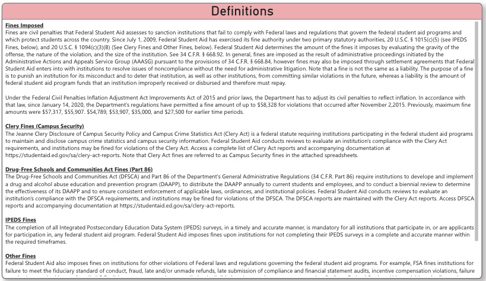

# fsa-fines-power-bi
# Federal Student Aid Fines Analysis — Power BI Dashboard

## Overview

This Power BI project analyzes fines imposed by Federal Student Aid (FSA) on
postsecondary institutions across multiple fiscal years.

The dashboard was designed to make enforcement activity easier to explore by
bringing together financial, institutional, geographic, and violation-level
information in one interactive report.

Users can compare fines across time, institutions, locations, violation types,
and university classifications.

---

## Dashboard Preview



### Interactive Dashboard Demo

The dashboard supports interactive fiscal-year filtering and dynamically
updates the KPI, geographic distribution, institution-level results,
violation categories, and fiscal-year analysis.



---

## Project Objectives

The dashboard was created to answer questions such as:

- How much has Federal Student Aid imposed in fines?
- How has enforcement activity changed across fiscal years?
- Which institutions received the largest fines?
- Which types of violations account for the greatest financial penalties?
- Where are fined institutions geographically concentrated?
- How do imposed fines differ across university types?

---

## Dashboard Features

### Fiscal Year Filtering

Users can filter the dashboard by fiscal year to examine changes in enforcement
activity over time.

### Total Imposed Fines

A KPI card summarizes the total dollar value of fines for the selected period.

### Fines by Violation Type

A detailed table shows the reasons fines were imposed and the corresponding
financial penalties.

### Geographic Analysis

An interactive map displays the geographic distribution of institutions that
received fines.

### Institution-Level Analysis

A table identifies fined universities and their corresponding imposed fine
amounts.

### Fiscal-Year Trends

A bar chart shows the number of fines imposed by fiscal year.

### University-Type Comparison

A donut chart compares imposed fine amounts across institution categories.

---

## Definitions and Context

The report includes a dedicated definitions page explaining the major categories
represented in the data.



Topics include:

- Clery Act / Campus Security fines
- Drug-Free Schools and Communities Act fines
- IPEDS fines
- Qui Tam cases
- Other Federal Student Aid violations

Including these definitions helps users interpret the dashboard within the
regulatory context of Federal Student Aid enforcement.

---

## Tools and Skills Demonstrated

- Microsoft Power BI
- Interactive dashboard development
- Data visualization
- Data filtering and slicing
- KPI design
- Geographic analysis
- Categorical analysis
- Business intelligence reporting
- Analytical storytelling

---

## Project File

The original Power BI project is included in this repository:

`FSA-Fines-Dashboard.pbix`

The file can be downloaded and opened using Microsoft Power BI Desktop to
explore the report interactively.

> Note: A public Power BI web version is not currently available because
> public web publishing is disabled by the organization's Power BI administrator.

---

## Data Source

Federal Student Aid / U.S. Department of Education

The project analyzes publicly available information related to fines imposed on
postsecondary institutions.

---

## Repository Structure

```text
fsa-fines-power-bi-dashboard/
│
├── README.md
├── FSA-Fines-Dashboard.pbix
│
└── images/
    ├── fsa-fines-dashboard-overview.png
    └── fsa-fines-definitions.png
